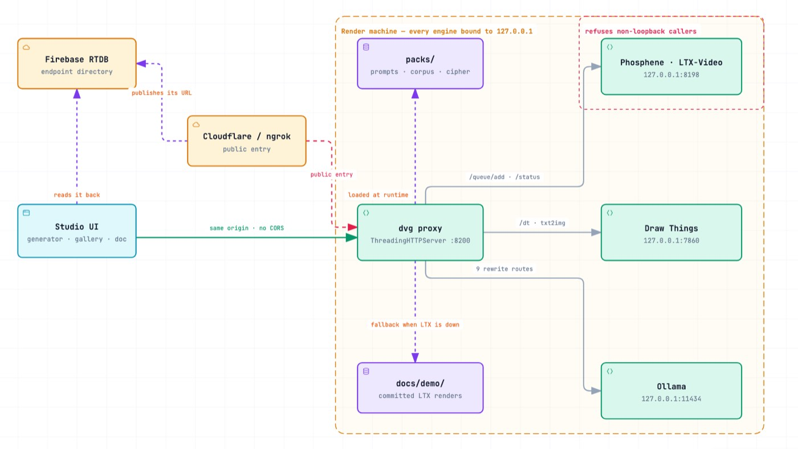
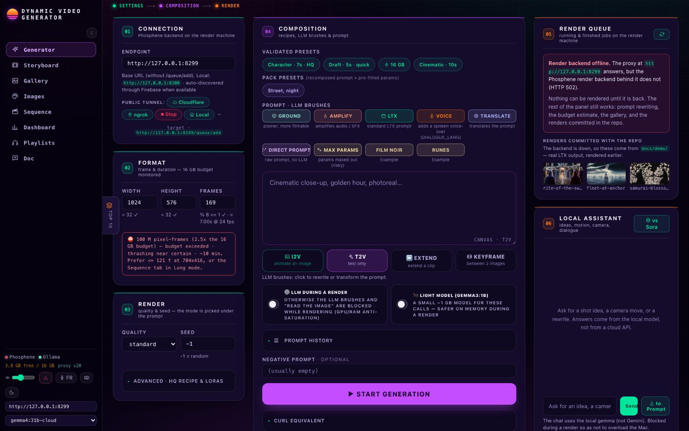
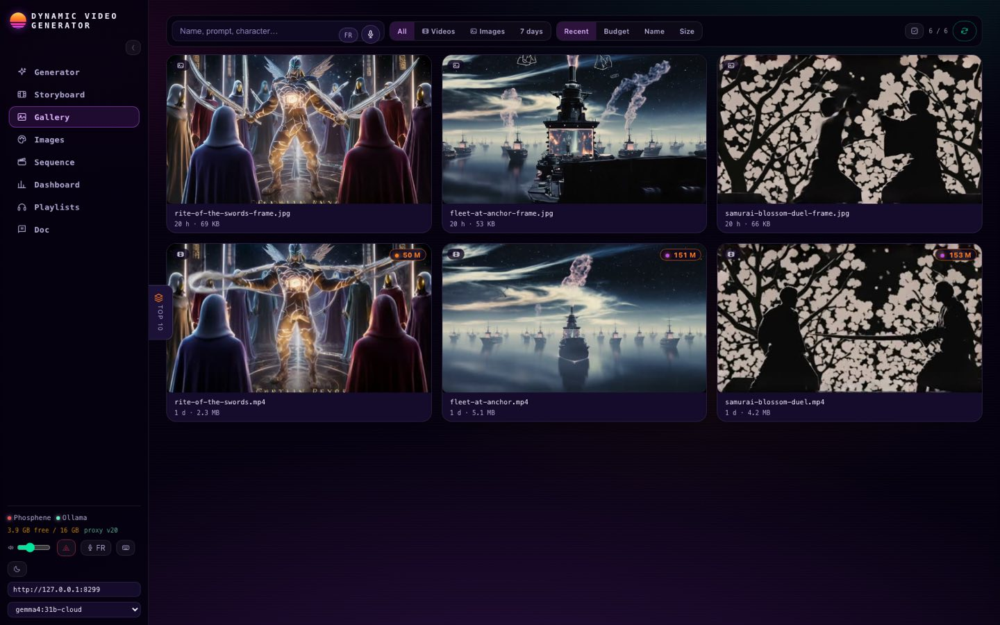
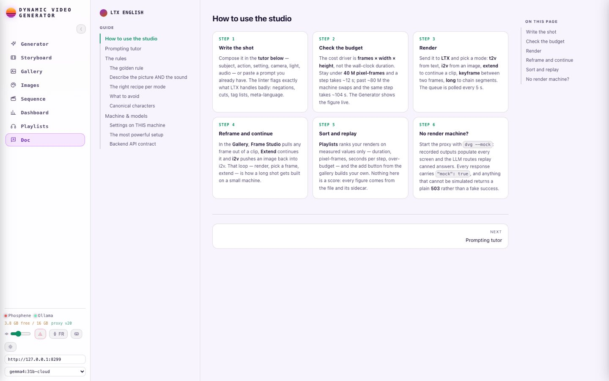
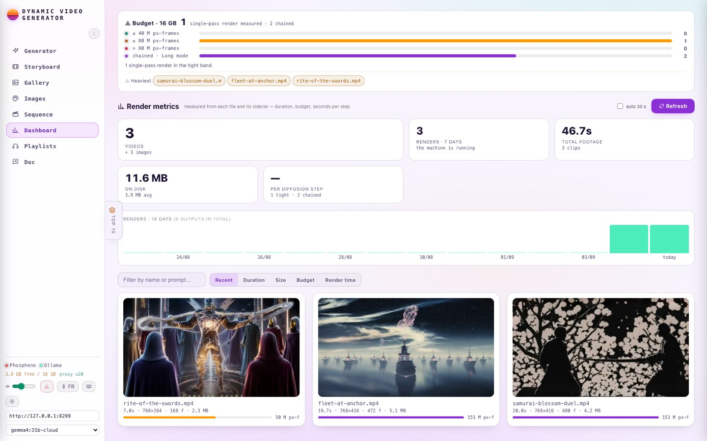

# Dynamic Video Generator

A **fully local** multimodal generation gateway: one web interface in front of a
video backend (LTX-Video), an image generator (Draw Things) and a local LLM
(Ollama) that rewrites prompts — with no cloud API calls, and without exposing
the render machine to the internet.

<picture>
  <source media="(prefers-color-scheme: dark)" srcset="docs/assets/architecture-dark.jpg">
  
</picture>

<sub>The browser only ever talks to the proxy, and the three engines never leave
`127.0.0.1`. Dashed edges are the parts that are allowed to be missing: the tunnel,
the style pack, and the fallback to the renders committed in the repository.
[`docs/architecture.html`](docs/architecture.html) is the same diagram as an
interactive page — open it locally for source links, guided views and tracing.</sub>



<sub>Shown with no render machine reachable, because that is the harder state to
get right: the queue says so in words, the budget estimate and the prompt
rewriting still work, and the panel falls back to the three LTX-2.3 renders
committed under `docs/demo/` rather than showing an empty screen.</sub>

---

## Problem

A text → image → video creative pipeline is expensive on hosted APIs and locks you
into their models. Running the whole chain locally on consumer Apple Silicon raises
three concrete problems, and this repository is the answer to those three:

1. **Browsers refuse to talk to local backends.** LTX-Video, Draw Things and Ollama
   each listen on a different port and none of them send CORS headers. A page served
   from anywhere else cannot call them.
2. **The render machine is not the work machine.** Video rendering saturates 16 GB of
   unified memory. You want it offloaded to a second Mac and driven from any browser,
   without opening a port to the internet.
3. **The memory budget is a cliff, not a slope.** As long as the model fits in unified
   memory, rendering is linear; the moment it swaps, the cost per step is multiplied by
   roughly 9 (measurements below). You need to see that *before* you hit Render.

## Architecture

```
  browser  ──►  same-origin proxy :8200  ──┬──►  LTX-Video      :8198
  (any                   │                 ├──►  Draw Things    :7860
   machine)              │                 └──►  Ollama         :11434
                         │
                         ├── serves the pages (same origin as the API)
                         ├── injects server config into the HTML
                         └── loads a "style pack" (data, kept out of the repo)

  render machine  ──►  Cloudflare tunnel  ──►  ephemeral URL published to a
                                               Realtime DB that the client
                                               reads back on page load
```

**Same-origin proxy.** The pages are served by the proxy itself, so the browser sees a
single origin and CORS stops being a problem. No page contains a hardcoded backend URL,
which means the same page works identically on localhost and through the tunnel.

**Dynamic tunnel resolution.** A free Cloudflare tunnel gets a new URL on every restart.
Rather than hardcoding it, the render machine publishes it to a Realtime DB and the
client reads it back on load. An empty `FIREBASE_DB` disables discovery and falls back
to a manually entered endpoint.

**No backend identifiers in the tree.** Every endpoint the client talks to is injected
by the proxy from `.env` at page-serve time, so a clone starts pointing at nothing until
you fill in your own. A contract test fails the build if a project reference is ever
hardcoded back into a page.

**Style packs.** The engine knows about no narrative universe. System prompts,
characters, word banks and prompt transforms are **data**, loaded at runtime from a
pack (`PHOS_PACK`). With no pack, the interface runs on its generic routes; with a pack,
its routes and its screens extend themselves. `packs/example/` demonstrates the
mechanism; private packs live outside the repository.

**Clean degradation.** `--mock` replays recorded responses in place of the render
backend and the LLM, so the full interface stays navigable on a single machine. A route
that cannot be simulated returns an explicit **503** — never a fake success.

## Measured results

LTX-Video rendering on a Mac mini M4, 16 GB unified memory:

| Load (pixel-frames) | Cost per step | Regime |
|---|---|---|
| 35 M | **12 s** | fits in unified memory |
| 221 M | **104 s** | swapping — thrashing |

That is a **≈ 9×** penalty for crossing the budget, not a gradual slowdown. Hence two
things in this repository: `scripts/preflight.sh`, which frees memory and returns a
GO/NO-GO verdict before a heavy render, and a live budget readout in the interface
(≤ 40 M green, ≤ 80 M amber, beyond that red).

The dashboard reports the same budget across every past render, alongside duration,
resolution, file size and seconds per diffusion step. Each figure is read from the
file and from the sidecar the backend writes next to it — the dashboard scores
nothing and estimates nothing.

That cuts both ways: the demo renders in `docs/demo/` came off a machine that no
longer exists, and their step counts and render times were not preserved, so the
seconds-per-step readout shows "—" for them rather than a plausible number. The
budget is a **per-pass** limit, so clips chained in Long mode are reported as
chained instead of being totalled and flagged over.

## Reproducing

```bash
git clone <url> && cd dynamic-video-generator
```

```bash
uv sync --extra dev && cp .env.example .env
```

**Without a render machine** — everything runs on one machine, no model weights
needed. Three real LTX-2.3 renders ship in `docs/demo/` (768×416 and 768×384,
24 fps, with the model's synchronised audio), so the gallery, the player and
the dashboard work on actual output rather than on placeholders:

```bash
PHOS_PACK=example uv run dvg --mock
```

Then open <http://127.0.0.1:8200/>: the generator, dashboard, gallery, storyboard and
playlists are all populated with recorded outputs. Every response carries `"mock": true`.

**With the real chain** — LTX-Video on the render machine (see
[docs/INSTALL_M4.md](docs/INSTALL_M4.md)), Ollama and Draw Things locally:

```bash
./scripts/preflight.sh
```

```bash
./scripts/start.sh --cloudflare
```

Tests:

```bash
uv run pytest
```

## The interface

| | |
|---|---|
|  |  |
| **Gallery** — every tile carries its pixel-frame budget. Frames and clips sit together; the player reads the committed renders directly. | **The guide** at `/doc` — its own page, read one section at a time, with the prompting tutor and a linter that flags what LTX handles badly. |



<sub>Both themes are first-class: the palette is a token swap, and the choice is
applied before the first paint so no load flashes the wrong one. Every figure
here comes off the file and the sidecar beside it — the two 20-second clips were
chained in Long mode, so they are counted apart from the per-pass budget rather
than totalled and flagged, and seconds-per-step reads "—" because that render
time was never recorded, not because it is zero.</sub>

## Layout

| Path | Role |
|---|---|
| `src/dynamic_video_generator/proxy.py` | same-origin proxy, backend routing, page serving |
| `src/dynamic_video_generator/personas.py` | prompt and style-pack loading |
| `src/dynamic_video_generator/mock.py` | recorded responses behind `--mock` |
| `src/dynamic_video_generator/prompts/` | engine system prompts (no universe) |
| `packs/example/` | demo pack: transforms, corpus, cipher |
| `web/` | pages served from the same origin as the API |
| `scripts/` | launcher, memory preflight, standalone bundle build |
| `tools/` | clip cutting and contact sheets for LoRA datasets |

## Proxy API

| Route | Role |
|---|---|
| `POST /ltx` `/director` `/dialogue` `/translate` `/ground` `/amplify` `/imgprompt` | prompt rewriting through the local LLM |
| `GET /transforms` | active routes — the UI builds its buttons from this |
| `GET /corpus` `/characters` | active pack data (`{}` with no pack) |
| `GET /health` `/models` `/tunnel/url` | proxy and backend status |
| `POST /storyboard` `/caption` `/caption-video` | structured storyboard, dataset captions |

## Writing a pack

A pack is a directory with a `pack.json`:

```json
{
  "id": "example",
  "name": "Example",
  "transforms": {
    "/noir": {"tag": "NOIR", "system": "prompts/noir.txt", "label": "🎩 Film noir"},
    "/runes": {"tag": "RUNES", "system": "prompts/runes.txt", "cipher": "cipher.json"}
  },
  "overrides": {"chat": "prompts/chat.txt"},
  "corpus": "corpus.json",
  "characters": "characters.json",
  "roster": "roster.txt"
}
```

Every key is optional. `PHOS_PACKS_DIR` points at the pack root and `PHOS_PACK` selects
one. Private packs stay outside the repository.

## A note on the name `phosphene`

`phosphene` in this codebase refers to the **third-party** LTX backend
([mrbizarro/phosphene](https://github.com/mrbizarro/phosphene)) running on port 8198 —
not to this project. `PHOSPHENE_PORT` and related identifiers are deliberately left
untouched. The `phos_` prefix on `localStorage` keys, `/tmp` runtime files and
environment variables is legacy and kept on purpose: renaming those keys would wipe
saved playlists, prompt history and settings in existing browsers.

## What this repository is not

There is a second piece — a Next.js + Supabase platform where several people register
their own render endpoint and share a ranked gallery. It is written and it runs, and it
is a separate project: nothing here depends on it, and this repository holds none of it.

It is kept out for a reason worth stating. Its authorisation needed work: an edge
function decided who was calling by base64-decoding a JWT payload without checking the
signature, and sign-up minted confirmed accounts on addresses nobody had proven they
owned. Both are fixed, neither is redeployed and re-tested. And its RLS policies live in
a Supabase dashboard rather than in migrations, so nobody reading the code could verify
the layer everything else leans on. Publishing that would mean shipping a security
posture no reviewer could check.

## Not built yet — where a V2 would go

One known gap, stated rather than hidden: `/caption-video` writes LoRA dataset
captions and nothing in the interface consumes them. The tooling for that lives in
`tools/` and is run by hand.

## Licence

MIT — see [LICENSE](LICENSE).
